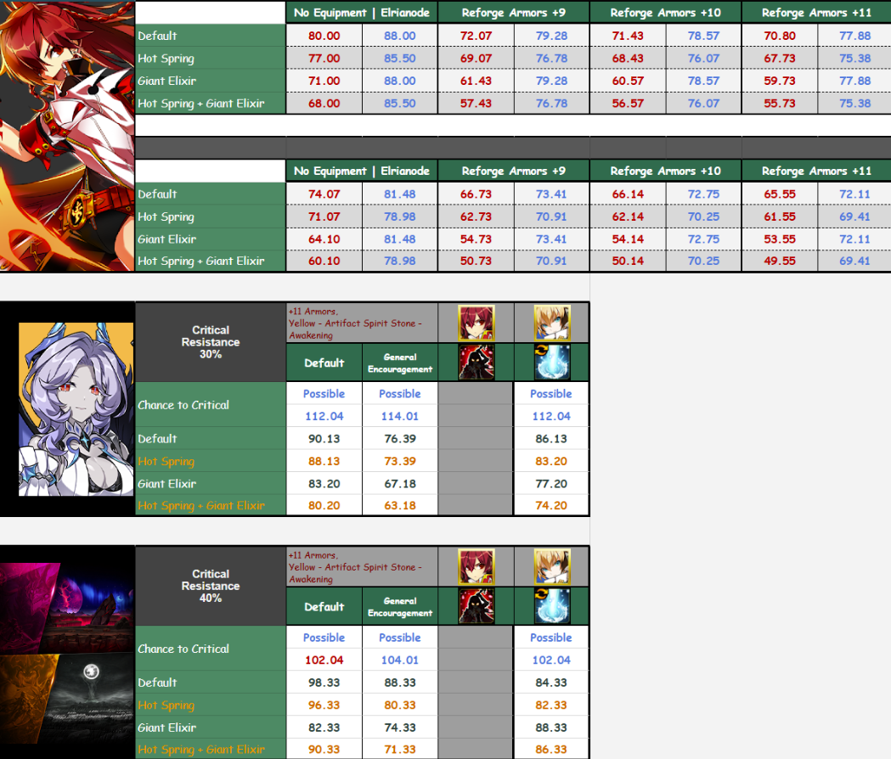

# Flame Lord Guide

> Elesis 2nd path · Pyro Knight → Blazing Heart → **Flame Lord** 🔥

---

## Clearing

ERP queen. Trait for Megabuster: choose **Gigantic**. One Megabuster = POOF.

---

## Mana & Cooldowns

- **35%+ CDR** (unless running Blue Exa; normally Red Exa)
-  Has  — recovers **5 MP/sec**
- Skill MP cost: at least **15%**, ideally **30%+** for smooth gameplay

---

## DPS & Characteristics

Mid bosser — slightly weaker than other top-tier classes. She's okay at 21-1 ~ 21-4.
21-5 is not as good as other characters because she doesn't quite have a HUGE boss skill.

### High Entropy (End-Game) Performance

> BQ > FL ≈ AD >> ES
> *Times don't directly equal DPS ranking — too many variables (weekly rotation,  usage, etc.)*

### Weaknesses

1. Even with max CDR, sometimes needs extra actions to reset cooldowns during burst
2. No damage reduction skill — even though she has "Fire Protection"

---

## Build

- There's a complete build of me but below is the overview of my gear. This is the cobodex calculator JSON — just copy-paste the whole thing and you can see my complete gear: https://github.com/Hemirich/elsword-guides/blob/main/Elsword/Character%20Build.md.
- I'm currently using Red Exa  so I'm only focusing on Exa.
- The pants I'm using are ECS, but normally people use Polarize pants.

> ***Make sure your action speed is 120% on your status board. Flame Lord needs action speed for her to cast faster.***
> ***Make sure your fire resistance is 500 because one of her passives requires full fire resistance.***

---

## ERP

Current build shown above — adjust values based on your gear.

Priority: Skill Damage → CDR → Adaptation → Polarize → Boss Damage → Max MP

---

## Skill Build

### Passives

- *Magical Attack Power Increase: 15%*
- *Fire Resistance Increase: 150*

**Using Special Active skills will stack the [Seed of Fire] effect (Max 3 stacks).
At max stack, [Burning Flower] effect will be activated.**

Burning Flower:
- *All Skill Cooldown decrease by 20% (Excludes Hyperactive/Bond Skills)*
- *Magical Attack Power Increase: 14%*
- *5 MP Recovery per sec. — Duration: 20 sec.*

- *Magical Attack Critical Damage Increase: 15%*
- *Magical Attack Critical Chance Increase: 20%*
- *Maximize Increase: 12%*

Fire Stigma — Physical/Magical Defense Reduction: 10%
- *Max 2 Stacks*
- *Duration: 10 sec.*
- *Cooldown: 0.5 sec.*
- *Flame Judgment: Successful hit with Command/Active/Special Active after 2 stacks of Stigma*
- *Damage (Magical): 550%*
- *Cooldown: 3 sec.*

Certain buff durations will increase when you use Special Active skills.
- *Applied Buff: Red Lotus Sword (Flame Sword), Flame Protection (Flame Shield), Soul Ignition (Soul Ignition)*
- *Flame Protection, Soul Ignition will be obtained after Transcendence.*

- *Max MP Increase: 100*
- *Attacking (Command/Active) enemies with fire-related debuffs, Ignore guard/defense/damage reduction: 15%*
- *Magic Damage increased with higher fire resistance: 0~10% (1% increase per 50 Fire Resistance)*

- *Explosive Fist: Reduce Knockdown Rate by 1.5 per Flame Hit*
- *Sword Fire: Affected by Action Speed, Ignores Guard*
- *Avatar of Fire: Activation Damage Added 184% (Magical)*
- ***Eternal Fire: Affected by Action Speed, Ignores Guard***
- *Pillar of Fire: 10% chance to burn the enemy upon successful hit*
- *Blazing Wing: Initial Hit will reduce the target's MP by 10*
- *Flame Orb: [Flame Protection] buff applies when using the skill while awakened*
- *Fire Wall: Each hit reduces the target's MP by 2 and knockdown rate by 3*
- ***Ignis Crasher: When hitting enemies while under Gale effect, increase Received Physical/Magical Damage by 12% for 10 sec.***

- *Movement Speed/Action Speed Increase: 10%*
- *Attack Power Increase: 30%*
- *Recover 100% of damage from burns when HP is lower than 50%*
- *Duration: 20 sec.*

Release the power of fire upon **awakening**.
Upon awakening, certain buffs will apply immediately for a certain duration.
Buffs that are already applied will have **increased duration**.
- *Applied Buff: Red Lotus Sword (Flame Sword), Flame Protection (Flame Shield), Soul Ignition (Soul Ignition)*
- *Buff Duration: 20 sec.*

---

### Skill Set Explanation

 
- These two skills grant you the ability to **extend** buff time — always make sure your buff time is up.
- If you lose the buff time, just re-awaken and you'll be fine.

> If your buff time disappears you can only awaken to rebuff.  doesn't work if you don't have the buff.

 
- These two skills' cast times are directly affected by **Action Speed**.
- Make sure you have **120% Action Speed**.

- This skill gives you 10% Magic Attack Power based on fire resistance.
- Make sure you have max fire resistance.
- Because of this skill, for pets I'll use  because it gives **50 fire resistance**.

Select  for double traits.  — this one select **Light** for trait.
Any other skill — select **Damage increased to 144%, Cooldown increased to 120%**.

This is my RAID skill bar:

---

## DPS Rotation

### General

 →  →  →  →  →  → 

- After that, just press anything that's not on cooldown.
- Flame Lord is a pretty free class when it comes to skill rotation.
- **In the current patch the most important skill is**  **— it can reduce all Annihilation skills by 4 sec.**
- **You'll always want to use**  **whenever it's up, so you need to use**  **to reset** 

> I'm not an expert, but after multiple testing I think FL is a fun character to play because every boss skill rotation is different.
> If you want to be top chart every dungeon, go 

### Advanced

You are here to advance your FL class. I'll show you everything I know to make you understand how Lee Dong-shin ignores my character. I could literally fix her with my toe.

1️⃣ **Step 1**

After you figure out how to press skills and sort of *feel* her, you'll come to a point where sometimes you'll grey bar for 1~2 seconds. So you actually need onions to awaken — to trigger the artifact yellow effect (reduce all skill cooldown by 10%) or use the Setting Sun title.

2️⃣ **Step 2**

If you have , I'd suggest you do it **AFTER** you press . So the rotation would be:

 →  →  →  /  →  →  →  / 

3️⃣ **Step 3**

I'm a lazy flow user, but if you want to be the best  in the server, you need to time your:
- Flow 15 sec reset
- Artifact Effect
- Transcendent
- 

4️⃣ **Step 4**

You need to have **2** sets of skill rotation when it comes to big and small bosses. I'll use 21-3 and 21-5 as examples.

> *— Always focus on*  *regardless of boss size — it's the highest DPS skill she has.*
> *—*  *depends on the boss posture — you can have 2 or 3 hit boxes. I don't know how it works yet, but it seems like when small bossing the skill requires the boss to be in a certain posture to get 3 hit boxes.*

1. When small bossing,  and  become bad.
2. You need to focus on  and .
3. I'll replace  with  because  takes forever to do damage whereas  is instant damage.

1.  This skill is still good, but when you press it you have to wait for the animation to finish before you can move — whereas  is instant cast, so the DPS will be higher when bursting.
2. When big bossing,  and  can almost full hit.
3. Focus on    
